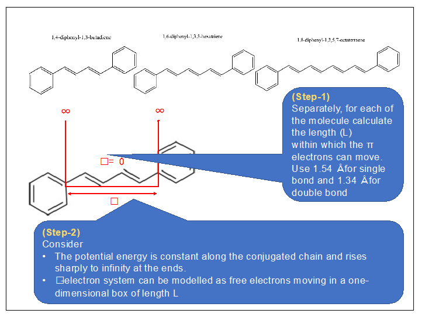
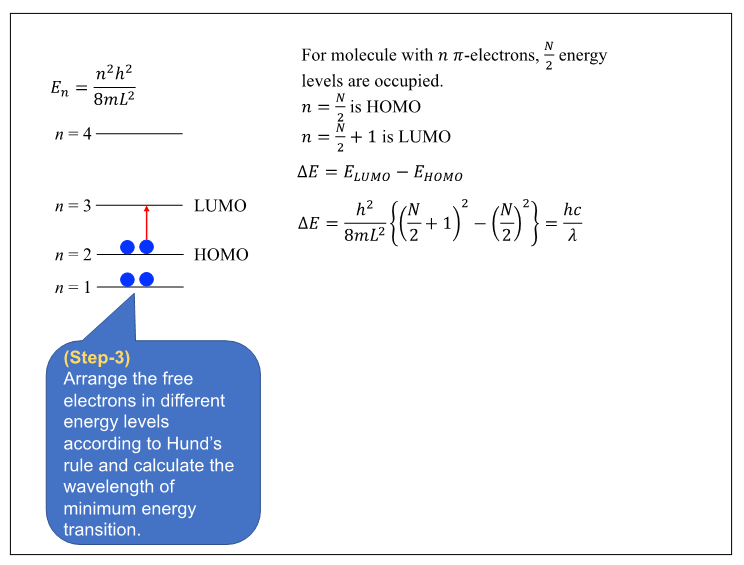
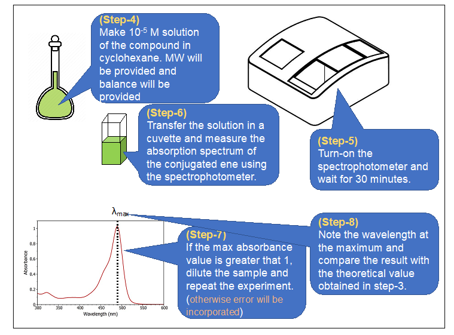
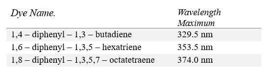
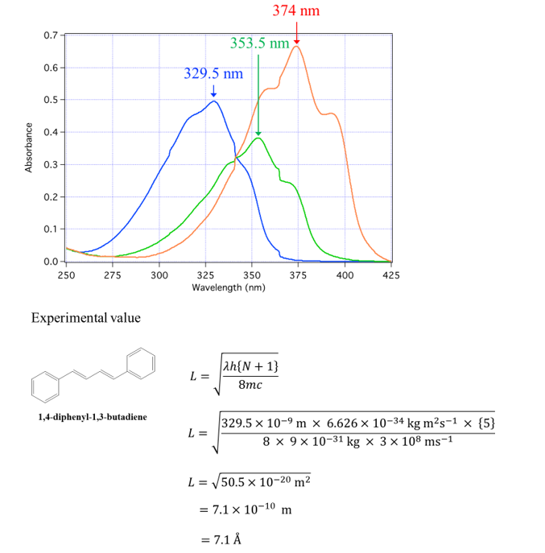
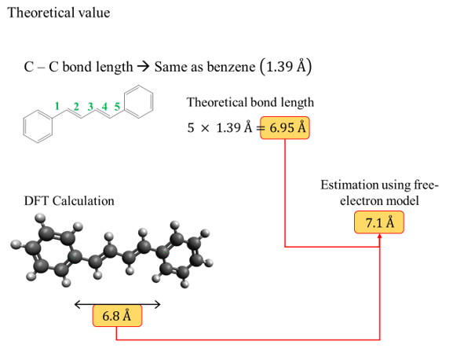

<b>1. Apparatus :</b> 
A) UV-Vis Spectrophotometer  

<b>2. Procedure in laboratory (diagram) :</b> 
 
 
  

<b>3. Procedure in laboratory :</b> 
<b>4. Data and the analysis :</b> 
 
 
  

<b>5. Analysis :</b> 
A.	Electronic spectra of conjugated dye  
B.	Test of free electron model

