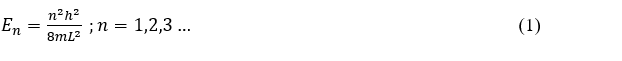
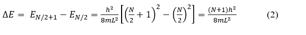
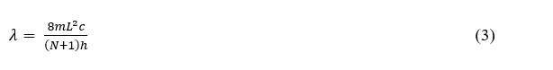

Absorption in the visible region of the spectrum correspond to transitions from the ground electronic state of a molecule to an excited electronic state. For π-conjugated organic molecule, the transition is typically π-π* in nature, and they appeared to be colored. 

Some of these compounds that will be investigated are – 

1,4 – diphenyl – 1,3 – butadiene 
1,6 – diphenyl – 1,3,5 – hexatriene 
1,8 – diphenyl – 1,3,5,7 – octatetraene 

We shall present here the simple free-electron model first proposed by Kuhn for successfully determining the energy of absorption for molecules like a conjugated dye. We shall assume that the potential energy is constant along the chain and that it rises sharply to infinity at the ends; i.e., the π electron system is replaced by the free electrons moving in a one- dimensional box of length L. The quantum mechanical solution for the energy levels of this model is  

En = (n2h2/8mL2 ) ;n = 1,2,3 ... &nbsp;&nbsp;&nbsp;&nbsp;&nbsp;&nbsp;&nbsp;&nbsp;&nbsp;&nbsp;&nbsp;&nbsp;  

<!--   -->

where m is the mass of an electron, n is quantum number and h is the Planck constant.  

Since the Pauli exclusion principle limits the number of electrons in any given energy level to two (these two have opposite spins: +½, -½) the ground state of a molecule with N π-electrons will have the N/2 lowest levels filled and all higher levels empty. When the molecule absorbs light, this is associated with one electron jump from the highest filled level (n1 = N/2) to the lowest empty level (n2 = N/2 + 1). The energy change for the transition is  

ΔE = EN/2+1 - EN/2  
= (h2/8mL2) [(N/2+1)2 - (N/2)2] 
= (N+1)h2/8mL2 &nbsp;&nbsp;&nbsp;&nbsp;&nbsp;&nbsp;&nbsp;&nbsp;&nbsp;&nbsp;&nbsp;&nbsp;  

<!--   -->

Since ΔE = hν = hc/λ, where c is the speed of light and λ is the wavelength, 

λ = 8mL2c/(N+1)h &nbsp;&nbsp;&nbsp;&nbsp;&nbsp;&nbsp;&nbsp;&nbsp;&nbsp;&nbsp;&nbsp;&nbsp;  

<!--   -->

From the above equation, wavelength of the transition at the absorption maxima can be determined for the compounds mentioned above. For each compound N is determined by counting the number of π electrons between the phenyl rings. The lowest energy transition occurs from the highest occupied energy level to the lowest unoccupied energy level. For example, 1,4-diphenyl-1,3-butadiene contains 4 π electrons between the phenyl rings. Thus, N = 4. In this series of diphenyl compounds, the length of the box is taken to be the distance between the phenyl rings. 